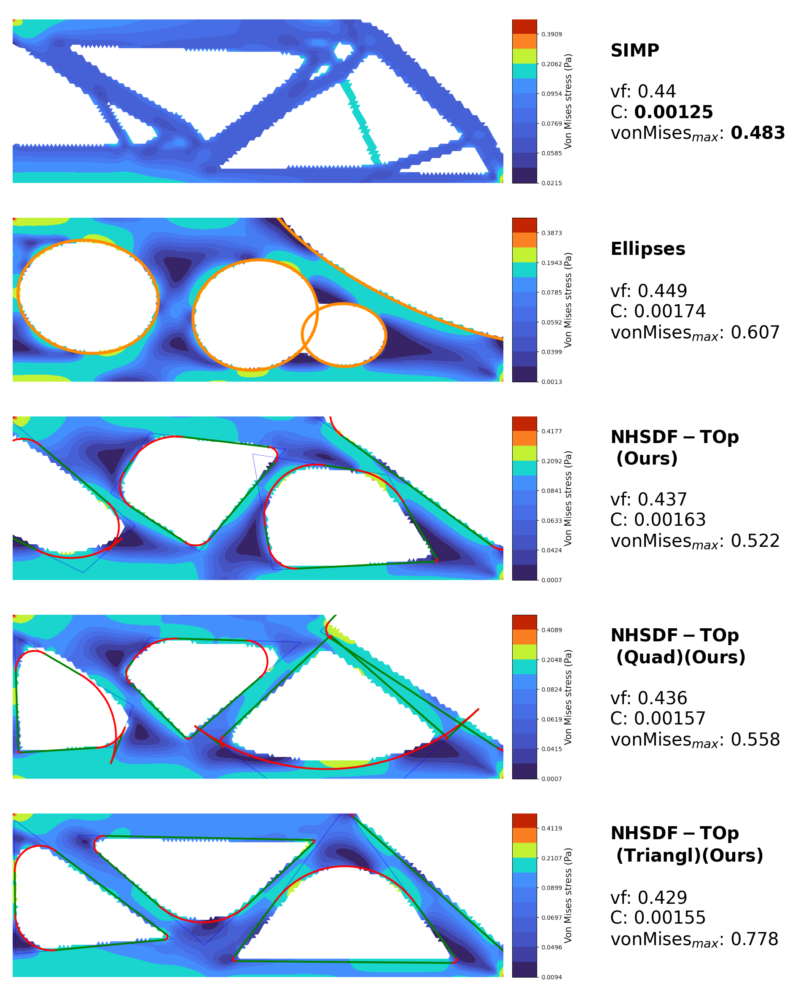

# NHSDF-TOp: Feature Mapping Topology Optimization with a Neural Approximation of the Heaviside Signed Distance Function Function


<p align="center">
  <figure style="display: inline-block; width: %;">
    
    <figcaption>MBB Beam Solution</figcaption>
  </figure>
</p>
The Neural Heaviside SDF Topology Optimizer project focuses on Feature-mapping Topology Optimization based on Neural Signed Distance Functions (Neural SDF).

## Generating Datasets

To generate datasets, use the following command or refer to the notebook examples in the `dataset_generation` folder. It is recommended not to change the `root_path`, as it is used in other scripts.

```bash
cd dataset_generation
python generate_datasets.py --root_path ../shape_datasets
```

## Training Models

To train the models, use the scripts in the `scripts` folder.

### First Strategy

Run the following command from the root folder:

```bash
bash scripts/train_first_strategy.sh
```

### Second Strategy

Run the following command from the root folder:

```bash
bash scripts/train_second_strategy.sh
```

### Comparison Table

To generate the comparison table, run the following command from the root folder:

```bash
python scripts/comparison_table.py --strategy first
```

## Saving Z Limits

Before running the Feature-mapping Topology Optimization with the trained models, you need to save the z limits of the models.

```bash
bash scripts/investigate_z_limits.sh
```

## Training only with Triangles and only with Quadrangles

To train only with triangles, run the following command:

```bash
bash scripts/VAEs_frst_strtg_triangl.sh
```

To train only with quadrangles, run the following command:

```bash
bash scripts/VAEs_frst_strtg_quad.sh
```

To compute and prepare Z limits for the training of the models that use only triangles and only quadrangles, run the following command:

```bash
bash scripts/VAEs_frst_strtg_triangl_z_lim.sh
```

```bash
bash scripts/VAEs_frst_strtg_quad_z_lim.sh
```


## Notebook Examples

Refer to the notebook examples in the `NN_TopOpt` folder for more examples:

- **SIMP Topology Optimization:** `NN_TopOpt/SIMP_examples.ipynb`
- **Feature-mapping Topology Optimization with Ellipses:** `NN_TopOpt/Ellipses_examples.ipynb`
- **Topology Optimization with Neural Heaviside SDF:** `NN_TopOpt/NHSDF_examples.ipynb`
- **Using the external solutions:** `NN_TopOpt/import_solution.ipynb`

**Utils to compare different methods** `scripts/method_comparison.ipynb`

**Examples of generated datasets** `dataset_generation/dataset_generation_examples.ipynb`  

To generate new tasks, see the notebook `test_problems/create_problem.ipynb`.
